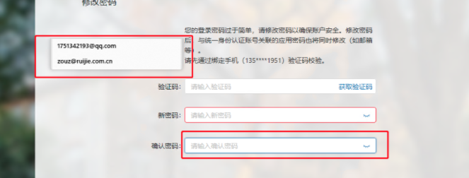

# 项目中兼容性问题汇总

## PC端兼容性汇总

#### 1、IE浏览器，点击键盘backspace键，页面会返回

#### 2、angular框架的表单校验，在IE浏览器下，会立即执行校验
https://github.com/angular/angular/issues/15299
https://github.com/angular/angular/issues/31904

3、win10 IE11浏览器-同时打开两个新增角色页面，两个页面互相切换，新增角色页面自动关闭

4、@font-face 未能完成opentype嵌入权限检查。权限必须是可安装的。
微信扫码二维码报错不展示，感叹号！

5、win8.1 firefox60(32位)-安全中心页面不完整


6、position：sticky兼容性问题

7、苹果ios滚动条问题

8、蚂蚁样式，IE浏览器输入框，点击时会向下稍有移动

9、Edge浏览器修改密码页面，点击输入框会出现一个浮窗。


10、title提示样式不同


11、


12、


13、


14、双向绑定失效

document.querySelector(".item-user-class").addEventListener)

Safari浏览器
function(e, n, r) {
    d(this, e, n, r), t.apply(this, arguments)
}

QQ浏览器
function(type, listener, useCapture) {
    var listeners = register_element(this);
    _super_["addEventListener"].apply(this, arguments);
    useCapture = useCapture ? 1 : 0;
    if (!listeners[useCapture][type]) listeners[useCapture][type] = [];
    listeners[useCapture][type].push(listener)
}

国际标准化组织的国际标准ISO8601是日期和时间的表示方法，全称为《数据存储和交换形式·信息交换·日期和时间的表示方法》。目前是第二版ISO8601:2000以替代第一版ISO8601:1988。

1. 时间格式问题兼容性问题(safari、window、chrome)
mongodb时间格式：2020-10-27T02:44:37.389+0000 mac转化错误 NaN


new Date("2020-10-27T02:44:37Z").getTime()
1603766677000

2. 


## 移动端兼容性汇总

### “认证页面”显示未适应手机尺寸，且输入用户名密码时只显示一半页面
```
vivo x6s plus   Android5.1.1  Funtouch os_3.0
```


### IOS9.2.1-个人中心页面，头像区域多出正方形边框


### 摄像头兼容性


自带浏览器，即使授权也有唤不起来的现象
Android7～9： 华为p20pro、荣耀10、华为P10、华为畅享7Plus、小米6、小米MI8 均唤起摄像头失败

https://stackoverflow.com/questions/29160819/how-to-use-getusermedia-in-chrome-for-ios/52917583

### 三星安卓9.0自带浏览器，用户名选择历史用过的用户名后，黄色底框不会消失


### 华为Android7.0-拍照采集失败图片下方显示黑色


### 华为荣耀9-EMUI:9.1.0-Android9-华为自带浏览器和QQ浏览器-采集照片人脸是反方向

+ vivo x6s plus-Android5.1.1-QQ浏览器（9.7.1）采集人脸信息照片是反的
+ 小米EMUI-Android8-QQ浏览器（9.7.1）采集人脸信息照片也是反的

### 浏览器对url长度的限制

1. IE浏览器对URL的长度现限制为2048字节。
2. 360极速浏览器对URL的长度限制为2118字节。
3. Firefox(Browser)对URL的长度限制为65536字节。
4. Safari(Browser)对URL的长度限制为80000字节。
5. Opera(Browser)对URL的长度限制为190000字节。
6. Google(chrome)对URL的长度限制为8182字节。

# 浏览器加粗效果
http://192.168.54.191/sid/bug/issues/2435

safari低版本浏览器不支持localstorage